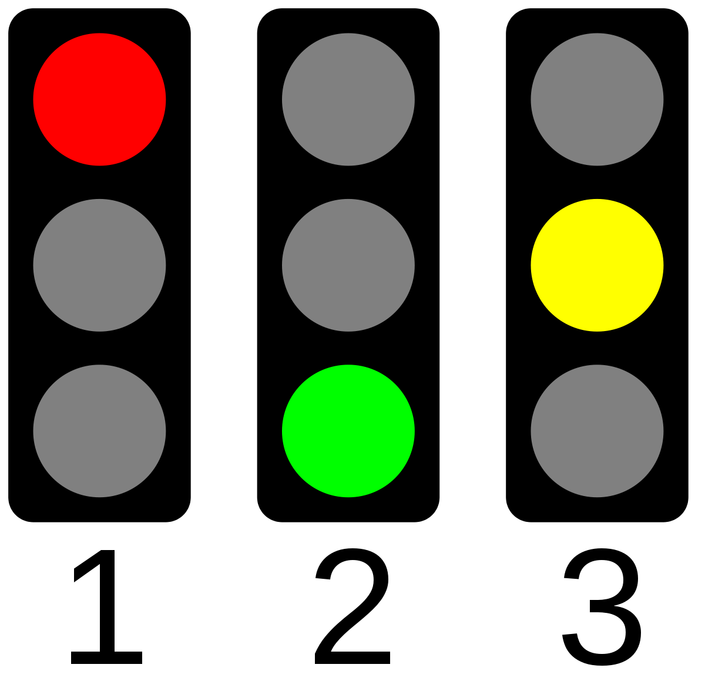

# Traffic light

this is a try to implement traffic light



for this project I use a state machine

## State machine

what is a state machine?

a state machine is a finite state machine (FSM) that is a finite automaton (automaton) that is a machine that is a set of states and transitions between these states.

in my case, I use a state machine to implement traffic light

for this I use 3 different states:
- orange
- green
- red


## how run project

for this project I use rust-lang and for run a rust program I use cargo

```cargo run --release```


you can see on [this link](https://www.rust-lang.org/tools/install) how to install rust

